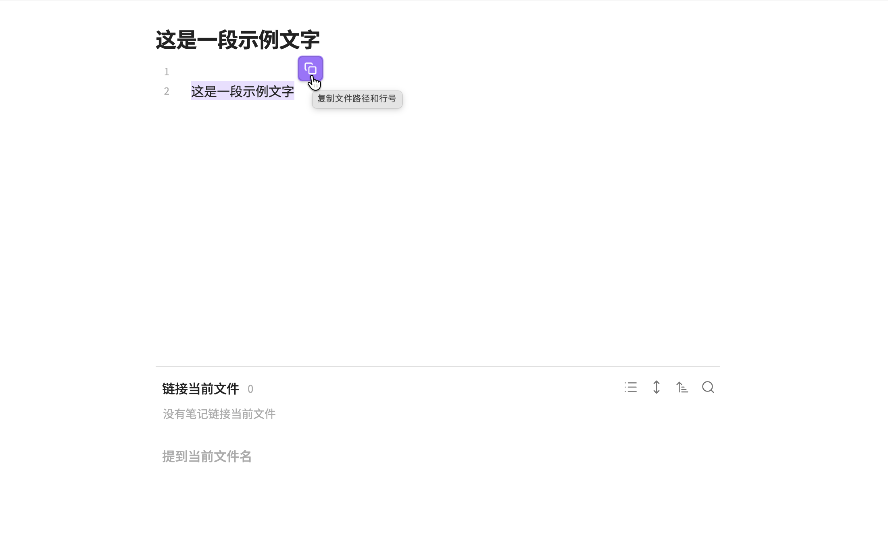
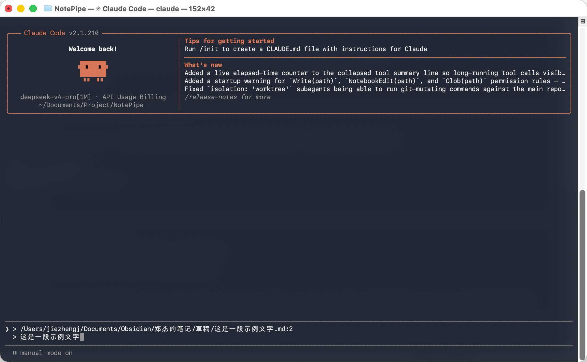

# NotePipe

[English](#english) | [中文](#中文)

<p align="center">
  
  <br/>
  
</p>

---

## English

One-click copy from Obsidian with file path and line number context — paste directly into AI agent terminals (Claude Code, etc.).

### Preview

Select text → click the floating button → paste into terminal. The output uses Markdown blockquote format (`>`) so the AI can clearly distinguish your reference from your question.

### Features

| | |
|---|---|
| 🔗 **Copy with context** | Assign a hotkey in Obsidian Settings → Hotkeys, then copy selected text with file path and line number |
| 🎯 **Floating button** | A button appears near your selection in both edit and reading mode |
| 📝 **Multi-scenario** | Edit mode, reading mode, and file explorer are all supported |
| 📂 **Absolute paths** | Outputs full filesystem paths by default — ready for terminal use |
| 🧩 **Customizable template** | 7 template variables (`{{path}}`, `{{selection}}`, `{{startLine}}`, etc.) |
| 🌐 **Bilingual UI** | Automatically matches your Obsidian language setting (English / Chinese) |

### Install

**Community plugin marketplace** — search "NotePipe" → Install → Enable.

Or manually:

```bash
cd /your-vault/.obsidian/plugins/
git clone https://github.com/jiezhengj/NotePipe.git
cd NotePipe
npm install
npm run build
```

### Usage

| Scenario | Action | Output |
|---|---|---|
| Edit mode — select text | Hotkey or command palette | `> /path/note.md:5`<br>`> selected text` |
| Reading mode — select text | Click floating button | `> /path/note.md:3-7`<br>`> multi-line selection` |
| File explorer — select files | Command palette → Copy | `> /path/note1.md` |

### Template variables

| Variable | Description |
|---|---|
| `{{path}}` | File path |
| `{{fileName}}` | Filename without extension |
| `{{startLine}}` | Start line number (1-indexed) |
| `{{endLine}}` | End line number |
| `{{selection}}` | Selected text |
| `{{lines}}` | Human-readable range ("Line 5" / "Lines 3-7") |
| `{{folder}}` | Parent folder path |

### Path mode

| Mode | Example | When to use |
|---|---|---|
| **absolute** (default) | `/Users/xxx/vault/note.md:5` | Pasting into terminal |
| **vault-relative** | `notes/daily.md:5` | Cross-machine portability |

### Hotkey

No default hotkey is set. To assign one:

1. Open Obsidian Settings → Hotkeys
2. Search "NotePipe: Copy with context"
3. Assign your preferred shortcut (e.g. `Cmd+Shift+C`)

| Platform | Recommendation | Note |
|---|---|---|
| macOS | `Cmd+Shift+C` | Usually available |
| Windows | `Ctrl+Shift+C` or `Alt+Shift+C` | `Ctrl+Shift+C` may conflict with terminal |
| Linux | `Ctrl+Shift+C` or `Alt+Shift+C` | GNOME / Konsole use `Ctrl+Shift+C` for copy |

### Development

```bash
git clone https://github.com/jiezhengj/NotePipe.git
cd NotePipe
npm install
npm run dev    # watch mode
npm run build  # production
```

```
src/
├── main.ts                  # Plugin entry
├── settings.ts              # Settings tab
├── template-engine.ts       # Template engine
├── context-resolver.ts      # Context resolver
├── floating-button.ts       # Floating button
├── copy-interceptor.ts      # Always-copy mode
└── i18n/
    ├── index.ts             # Translation
    └── locales/
        ├── en.ts
        └── zh.ts
```

### License

MIT

---

## 中文

在 Obsidian 中选中文本，一键复制为 `path:line` 格式，直接粘贴到 AI 终端（如 Claude Code）。

### 预览

选中文本 → 点击浮层按钮 → 粘贴到终端。输出采用 Markdown 引用块格式（`>` 前缀），AI 可以清晰区分引用内容和你的提问。

### 功能

| | |
|---|---|
| 🔗 **附带上下文复制** | 在 Obsidian 设置 → 快捷键中绑定后，一键复制选中文本并附带文件路径和行号 |
| 🎯 **浮层按钮** | 选中文本后选区右上角出现复制按钮，编辑/阅读模式均支持 |
| 📝 **多场景支持** | 编辑模式、阅读模式、文件列表均可使用 |
| 📂 **绝对路径** | 默认输出完整文件系统路径，终端中可直接定位 |
| 🧩 **可配置模板** | 7 个模板变量（`{{path}}`、`{{selection}}`、`{{startLine}}` 等） |
| 🌐 **中英文双语** | 自动跟随 Obsidian 语言设置 |

### 安装

**社区插件市场** — 搜索 "NotePipe" → 安装 → 启用。

或手动安装：

```bash
cd /你的vault/.obsidian/plugins/
git clone https://github.com/jiezhengj/NotePipe.git
cd NotePipe
npm install
npm run build
```

### 使用

| 场景 | 操作 | 输出 |
|---|---|---|
| 编辑模式选中文本 | 快捷键或命令面板 | `> /path/note.md:5`<br>`> 选中文本` |
| 阅读模式选中文本 | 点击浮层按钮 | `> /path/note.md:3-7`<br>`> 多行内容` |
| 文件列表选中文件 | 命令面板 → 复制 | `> /path/note1.md` |

### 模板变量

| 变量 | 说明 |
|---|---|
| `{{path}}` | 文件路径 |
| `{{fileName}}` | 文件名（无扩展名） |
| `{{startLine}}` | 起始行号（从 1 开始） |
| `{{endLine}}` | 结束行号 |
| `{{selection}}` | 选中文本 |
| `{{lines}}` | 可读行范围（"Line 5" / "Lines 3-7"） |
| `{{folder}}` | 父文件夹路径 |

### 路径模式

| 模式 | 示例 | 适用场景 |
|---|---|---|
| **absolute**（默认） | `/Users/xxx/vault/note.md:5` | 粘贴到终端使用 |
| **vault-relative** | `notes/daily.md:5` | 跨机器可移植 |

### 快捷键

插件不预设默认快捷键。设置方式：

1. 打开 Obsidian 设置 → 快捷键
2. 搜索 "NotePipe: 复制并附带上下文"
3. 绑定你习惯的快捷键（如 `Cmd+Shift+C`）

| 平台 | 推荐快捷键 | 注意 |
|---|---|---|
| macOS | `Cmd+Shift+C` | 一般无冲突 |
| Windows | `Ctrl+Shift+C` 或 `Alt+Shift+C` | `Ctrl+Shift+C` 可能与终端冲突 |
| Linux | `Ctrl+Shift+C` 或 `Alt+Shift+C` | GNOME / Konsole 占用 `Ctrl+Shift+C` |

### 开发

```bash
git clone https://github.com/jiezhengj/NotePipe.git
cd NotePipe
npm install
npm run dev    # 开发模式
npm run build  # 生产构建
```

```
src/
├── main.ts                  # 插件入口
├── settings.ts              # 设置页面
├── template-engine.ts       # 模板引擎
├── context-resolver.ts      # 上下文解析
├── floating-button.ts       # 浮层按钮
├── copy-interceptor.ts      # 始终复制模式
└── i18n/
    ├── index.ts             # 翻译函数
    └── locales/
        ├── en.ts
        └── zh.ts
```

### 许可证

MIT
